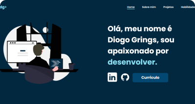

# Meu Portfólio

Bem-vindo ao repositório do meu portfólio! Este projeto foi desenvolvido para apresentar minhas habilidades, projetos e informações profissionais de forma organizada e responsiva.

## 🔗 Link do Projeto

[Veja meu portfólio online](https://diogogrings.vercel.app)

---

## Exemplo de Tela



---

## 📋 Funcionalidades

- 🌐 **Design Responsivo**: Compatível com dispositivos móveis, tablets e desktops.
- 💻 **Seções Organizadas**:
  - Home
  - Sobre Mim
  - Projetos
  - Habilidades

- 🎨 **Animações Suaves**: Uso do AOS (Animate On Scroll).
- ⚡ **Performance Otimizada**:
  - Imagens compactadas.
  - Código estruturado e eficiente.

---

## 🛠️ Tecnologias Utilizadas

- **HTML5**: Estrutura do site.
- **CSS3**: Estilização e responsividade.
- **JavaScript**: Interatividade e funcionalidade.
- **AOS**: Animações durante o scroll.

---

## 🚀 Como Rodar o Projeto

1. Clone o repositório:
   ```bash
   git clone https://github.com/seu-usuario/seu-repositorio.git